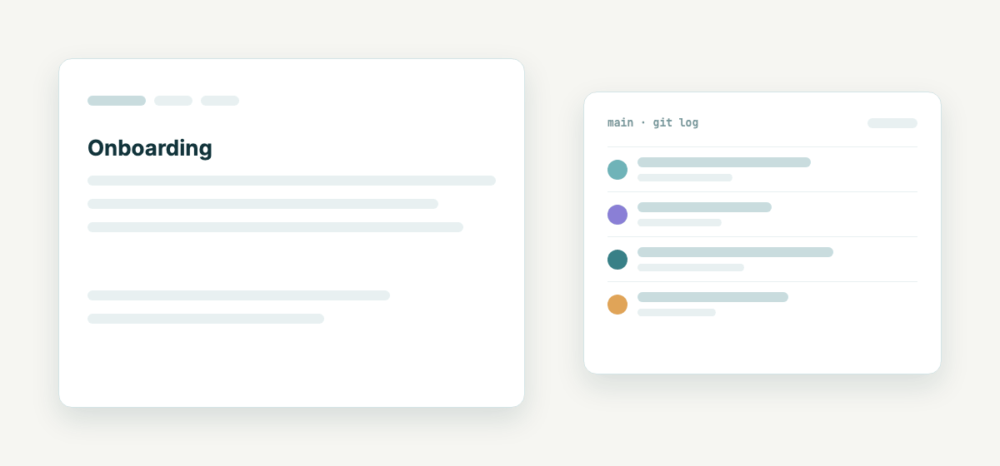
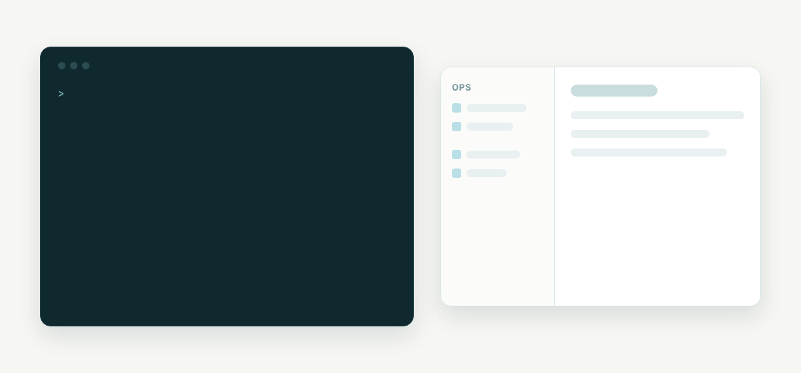
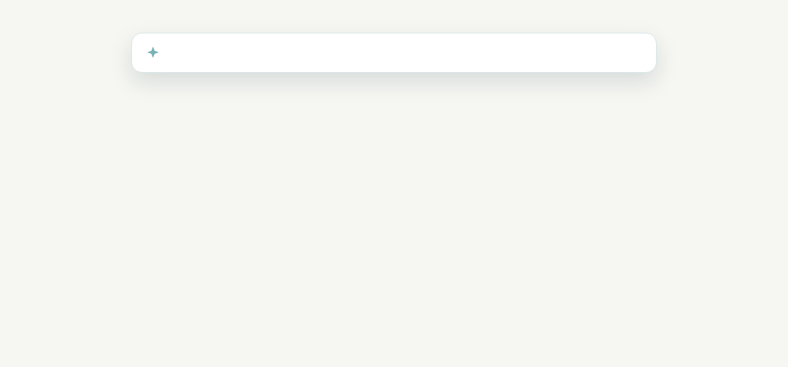
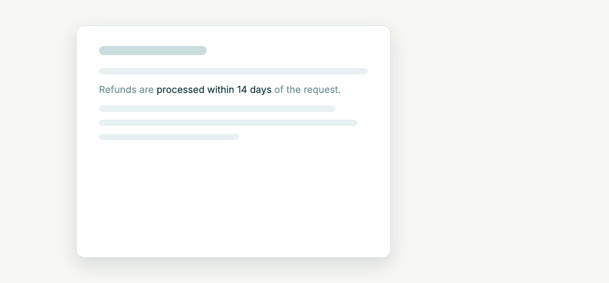
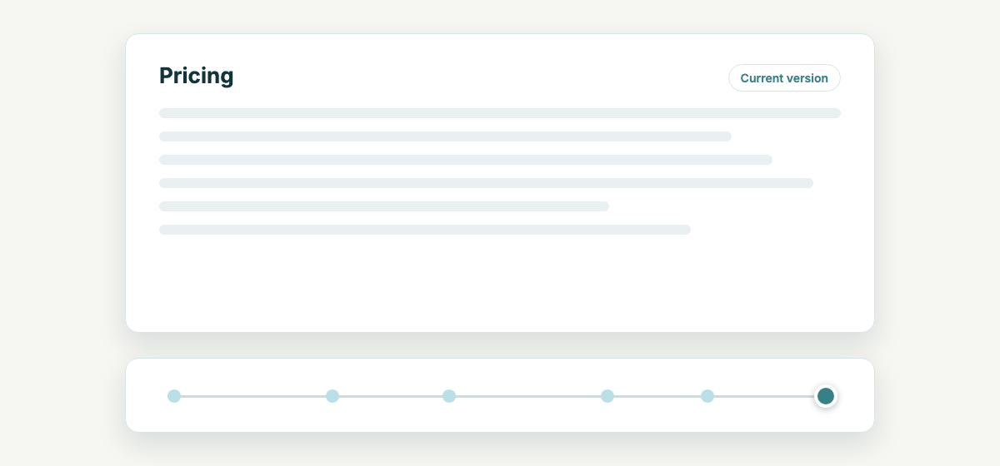
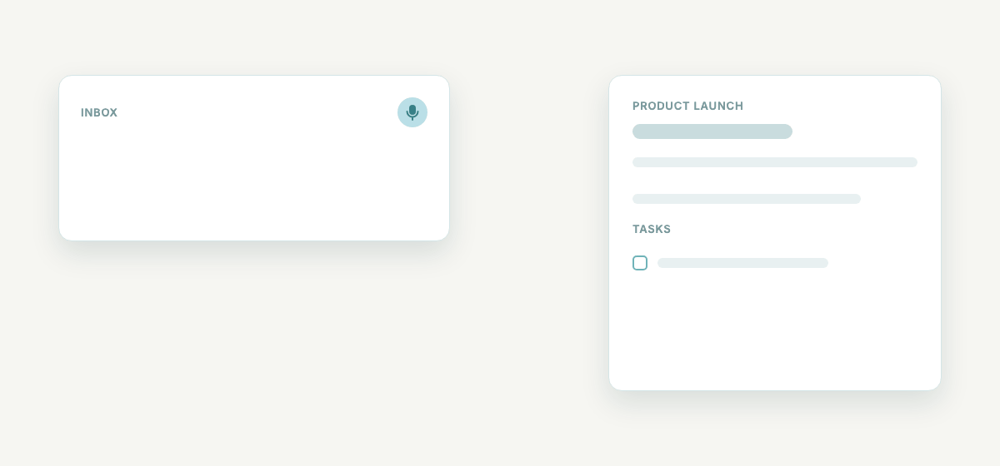

# DocuVault

Self-hosted team documentation with Git as the source of truth. Edit collaboratively in the browser; every save is a commit to your repo. Comes with a CRUD MCP server for local AI editing and a role-based permission system. AI features are optional.

 

**[Website](https://docuvault-promo.systaro.de)** · [Install guide](docs/install.md) · [MCP server](#mcp-server-for-ai-agents)

<p align="center"></p>

## Why

Most documentation tools either lock your content into a proprietary store (Notion, Confluence) or make you choose between web-editing and Git workflow (raw GitLab/GitHub, plain Markdown sites). DocuVault keeps both: your documents live as Markdown files in a Git repository you control, while the team gets a real WYSIWYG editor, search, sharing, and permissions on top.

For developers and AI tools, the same files are available locally — clone the repo, edit with Claude Code / Cursor / your editor of choice, push, and the web UI reflects the change. The included MCP server gives AI agents full CRUD access to documents without leaving the agent's tool loop.

## Features

- **Git-backed storage.** Every save commits to your Git repository (GitLab today; GitHub coming). Full version history for free.
- **Local-first AI editing.** Clone the repo and edit with any LLM tool that works on files. No vendor lock-in.
- **Full-CRUD MCP server.** Ships as `@systaro/docuvault-mcp` on npm. Drop it into any MCP-compatible client (Claude Desktop, Claude Code, Cursor) and your AI agent can list spaces, read documents, create them, edit them, and share them — directly.
- **WYSIWYG editor.** TipTap-based rich editor that emits clean Markdown.
- **Role-based permissions.** Super Admin, Org Admin, Editor, Viewer, plus fine-grained per-space permissions.
- **Teams.** Group users into teams (a user can be in several) and grant space access once per team instead of once per person. Members inherit every grant of every team they're in; the strongest grant — personal or inherited — wins.
- **Public share links.** Optional password protection, view-only or comment access. Renders rich markdown including embedded HTML and JavaScript (deliberate — see [SECURITY.md](SECURITY.md)).
- **Optional AI.** Ask questions about your documentation and find your conversations again across spaces, with answers that name their sources, create documents and propose edits you apply. Drafts of status reports and meeting protocols from a space's recent notes and tasks. Voice input, semantic search (pgvector + OpenAI embeddings) and writing assistance. The UI hides AI features when no API key is configured. See [docs/assistant.md](docs/assistant.md).
- **Tasks.** Tasks in spaces with assignee, due date and status, created by hand, from inbox notes, by the assistant, over MCP, or suggested from meeting action items. See [docs/tasks.md](docs/tasks.md).
- **Inbox / quick capture.** Write or speak a note first; the assistant suggests the space and the tasks in it, and you confirm. Notes are filed into documents later, with optional AI-assisted routing.
- **Email notifications.** Per-user instant or digest mode for space changes; password reset; invitations.
- **First-boot setup wizard.** No `ADMIN_EMAIL`/`ADMIN_PASSWORD` env vars to fumble — visit the URL, create the admin, done.
- **Admin settings UI.** Configure SMTP, OpenAI, and GitLab from the browser; values stored encrypted in the database.

## A quick look

| | |
|---|---|
| **AI agents write through MCP**<br> | **Ask your documentation**<br> |
| **Comments that stay on their words**<br> | **Scrub through version history**<br> |
| **Public links with password and comments**<br> | **Inbox with AI routing**<br> |

## Tech stack

- **Backend:** Spring Boot 3.2, Kotlin, JPA/Hibernate
- **Frontend:** Angular 18, TipTap
- **Database:** PostgreSQL 16 + pgvector
- **Object storage:** MinIO (for logos, attachments)
- **Cache / session store:** Redis
- **Reverse proxy + TLS:** nginx-proxy + acme-companion (Let's Encrypt)
- **Native apps:** Capacitor (iOS/Android) — optional

## Quick start

You need a Linux server with Docker, a DNS name pointing at it, and ports 80 + 443 open.

```bash
# On the target server
git clone --depth 1 https://github.com/Systaro/DocuVault.git /opt/docuvault
cd /opt/docuvault

cp .env.example.product .env
$EDITOR .env                 # fill in PUBLIC_HOSTNAME, secrets, SMTP credentials

./deploy.sh latest           # pulls the public images, backs up, swaps, health-checks
```

The images are public on `ghcr.io/systaro/docuvault`, so no registry login is needed.

Then visit `https://<your-hostname>` in a browser — the first-time setup wizard will walk you through creating an admin account.

Full install + upgrade documentation: [docs/install.md](docs/install.md).

## MCP server (for AI agents)

DocuVault runs its own MCP server at `/api/mcp` (Streamable HTTP). Connecting
works like connecting GitLab: one URL in the client, a consent page in the
browser, done. No token to copy, nothing to install.

```bash
claude mcp add --transport http docuvault https://your-docuvault.example.com/api/mcp
# then, in a session: /mcp → docuvault → Authenticate
```

Claude Desktop, Cursor and other clients with HTTP transport and OAuth support
take the same URL:

```jsonc
{
  "mcpServers": {
    "docuvault": { "type": "http", "url": "https://your-docuvault.example.com/api/mcp" }
  }
}
```

The server exposes 19 tools covering search/list/read/create/edit/share for
documents, spaces and space state, tasks (`list_tasks`, `create_task`,
`update_task`), plus `upload_file` / `download_file` for
binaries and large files: they hand out a one-time URL and the agent moves the
bytes with `curl` (or `Invoke-WebRequest` on Windows), so nothing binary
passes through the model. Every call runs as the signed-in user with that
user's space permissions. For scripts and CI, where no browser is
available, the same endpoint accepts a personal API token from your account
page as `Authorization: Bearer dv_...` header.

The OAuth side is a small built-in authorization server (dynamic client
registration, PKCE, refresh rotation); clients discover it through
`/.well-known/oauth-protected-resource` and `/.well-known/oauth-authorization-server`,
which the frontend nginx forwards to the backend. `PUBLIC_URL` is the OAuth
issuer, so it has to be exactly the URL clients use.

The legacy stdio package `@systaro/docuvault-mcp` (`npx`, API token in the env)
still works for clients without HTTP/OAuth support.

## Status

DocuVault is in **early access**. The data model and APIs are stable for self-hosting; expect occasional breaking changes in minor versions until 1.0. Release notes live at [GitHub Releases](https://github.com/Systaro/DocuVault/releases) and the in-app banner will tell you when a new version is available.

## License

[Business Source License 1.1](LICENSE). Free to use and modify for self-hosting; **commercial production use as a competing hosted service requires a separate agreement**. The license auto-converts to Apache 2.0 after four years per version. For commercial licensing, contact `licensing@systaro.de`.

## Security

See [SECURITY.md](SECURITY.md). TL;DR: disclose privately to `security@systaro.de`, and be aware that public share links intentionally render embedded HTML and JavaScript.
